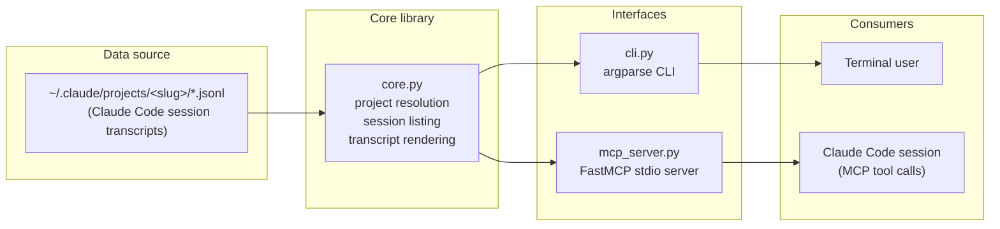

# Architecture

See [`tech.md`](tech.md) for the technology choices referenced below.

## Overview

The project is a thin, two-interface shell around a single dependency-free
core library. All domain logic — finding a project, listing its sessions,
and rendering a transcript to text — lives in `core.py`; `cli.py` and
`mcp_server.py` are both stateless adapters that call into it and format
its results for their respective audience (a terminal user, or an MCP
client such as a Claude Code session).

## Core library (`core.py`)

Four responsibilities, each a small pure function or generator over the
filesystem — no interface-specific concerns (argument parsing, tool
schemas, error formatting) leak into this module:

1. **Project resolution** — `project_slug_for_path()` reproduces Claude
   Code's slug algorithm (`[\\/:]` → `-`); `resolve_project_dir()` accepts
   either a raw slug or a working-directory path and returns the matching
   directory under `~/.claude/projects`. A literal-slug match is only
   attempted when the input has no path separators, specifically to avoid
   `pathlib`'s "an absolute right-hand path replaces the left side" join
   behavior silently defeating the lookup (see `CHANGE_LOG.md`, Fixed).

2. **Session discovery** — `list_sessions()` globs a project directory for
   `*.jsonl`, scanning each file just far enough to collect a
   `SessionInfo` (id, start timestamp, message count, first user message,
   mtime) without holding the whole transcript in memory, then sorts by
   mtime descending. `find_session()` layers token resolution on top —
   `latest`, a 1-based index into that same ordering, or an exact/partial
   session-id match (raising on zero or multiple matches rather than
   guessing).

3. **Transcript rendering** — `render_session_text()` walks a transcript
   line by line, keeps only `user`/`assistant` entries, and turns each
   content block into a labeled section (`_block_to_text`): plain text
   passes through, `thinking`/`tool_use`/`tool_result`/`image` blocks get
   a `[label]` prefix, and `tool_use`/`tool_result` payloads are
   length-truncated by default. Turns that render to empty text (after
   truncation/formatting) are dropped rather than emitted as empty
   sections.

4. **Export** — `export_session()` composes the three functions above and
   writes the result to disk, generating a filename from the session id
   when the caller passes no output path or a directory.

Everything above raises plain stdlib exceptions
(`FileNotFoundError`/`IndexError`/`ValueError`) on failure; neither
interface layer wraps these in custom exception types, they just decide
how to present them.

## CLI (`cli.py`)

A conventional `argparse` subcommand tree (`list-projects`,
`list-sessions`, `export`) that maps flags directly onto `core.py`
parameters (`--project`, `-o/--output`, `--full`). The one piece of
interface-specific logic is the top-level `try/except` in `main()`, which
catches the core library's exceptions, prints `error: <message>` to
stderr, and exits `1` — everything else is a direct call-through.

## Optional installer (`scripts/install-shim.ps1` / `.sh`)

`claude-export` is not a third interface onto `core.py` — it's a thin
invocation wrapper around the CLI itself, so `claude-export <args>` is
exactly `<python> cli.py <args>` with no behavioral difference. The
installer writes shim file(s) into `~/.local/bin` rather than adding
this repo's own directory to `PATH`, on the premise that `~/.local/bin`
is a directory already on `PATH` in many dev setups — one shared bin
directory reused by every tool beats one `PATH` entry per tool/clone.
This means, unlike a shim shipped inside the repo, the installed files
hardcode this clone's absolute `cli.py` path and must be re-run if the
repo moves; the installer is idempotent (safe to re-run) specifically to
make that cheap. It also never edits `PATH` itself — if `~/.local/bin`
isn't already present, it prints the exact line for the user to add to
their shell config instead of mutating a machine-wide setting on their
behalf.

There are two implementations of this same design, one per platform
family: `install-shim.ps1` (Windows) writes `claude-export.cmd` plus a
POSIX `claude-export` (for Git Bash) and invokes `cli.py` via `py -3`;
`install-shim.sh` (macOS/Linux) writes just `claude-export` and invokes
`cli.py` via `python3`. Both resolve their own repo root the same way —
relative to the installer script's own location (`$PSScriptRoot` /
`BASH_SOURCE`) — so either one works correctly regardless of where the
repo is cloned. See `tech.md` for why the shims invoke the `py`/`python3`
launcher while the MCP registration instead uses an absolute
interpreter path.

## MCP server (`mcp_server.py`)

Uses `FastMCP` to declare three tools as thin wrappers:
`list_projects`, `list_project_sessions`, `export_session_to_file`. Two
design points follow directly from how MCP servers run, not from any
property of `core.py`:

- **`project` is a required argument on every tool**, not optional. The
  server is a long-lived subprocess with its own working directory, which
  has no relationship to the working directory of whatever Claude Code
  session is calling it — so unlike the CLI (where "default to `cwd`" is
  meaningful because the CLI *is* invoked from the relevant directory),
  the MCP layer cannot safely default `project` and instead documents in
  each tool's docstring that callers must pass their own working
  directory or a known slug.
- **`export_session_to_file` returns a path and size, not the transcript
  text.** Session transcripts can run to many megabytes; returning that
  inline as a tool result would flood the calling session's context for
  no benefit over just reading the file it already wrote.

Errors surface as whatever `FastMCP` does by default with an uncaught
Python exception from a tool function (an MCP tool-call error result) —
there is no bespoke error handling in this layer, mirroring the "let
`core.py`'s exceptions speak for themselves" approach used in the CLI.

### Registration installer (`scripts/install-mcp-server.ps1` / `.sh`)

Registering an MCP server with Claude Code (find the right interpreter,
install `mcp` for it, run `claude mcp add --scope user` with both
absolute paths) is several manual, error-prone steps — get the Python
path wrong and `claude mcp list` just shows a silent failure. These
scripts automate exactly those steps and nothing else: neither touches
`core.py`, `cli.py`, or `mcp_server.py`, and both treat the `claude` CLI
as the source of truth for registration state rather than editing
`~/.claude.json` directly. Because `claude mcp add` errors on a name
that's already registered, each script first checks with `claude mcp
get` and removes any existing registration, making a re-run (e.g. after
moving the repo) update the registration instead of failing.

The two scripts are independent implementations of the same logic, not
a shared library, since there's no cross-platform-shell mechanism to
share code between a `.ps1` and a `.sh` here: `install-mcp-server.ps1`
resolves `python.exe` via `python -c "import sys; print(sys.executable)"`
run through `py -3`; `install-mcp-server.sh` does the analogous
`python3 -c '...'`, plus an explicit check that the resolved path is
executable (POSIX shells don't have PowerShell's `Test-Path`-with-throw
idiom, so this is done by hand) and a note in its `pip install` failure
path about `--user`/virtualenvs, since Debian/Ubuntu and Homebrew Python
installs commonly refuse an unscoped `pip install` ("externally managed
environment").

## Why one core, two interfaces

The CLI and MCP server serve different callers with different framing
needs (human-readable list output vs. structured dicts; stderr+exit-code
errors vs. MCP error results; implicit cwd default vs. mandatory
`project`), but the underlying operations — resolve a project, list its
sessions, render one to text — are identical. Keeping that logic in
`core.py` and importing it from both interfaces means a change to, say,
the slug algorithm or the truncation limits, only has to happen once.
